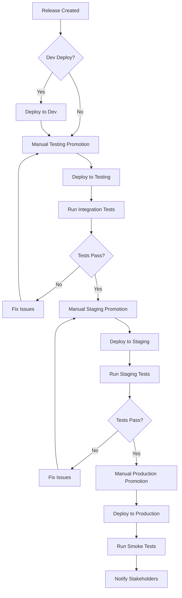

# Build, Release, and Deployment Framework Design

## Overview

This document outlines the design for a comprehensive Build, Release, and Deployment framework using GitHub Actions for .NET applications. The framework implements a modern CI/CD pipeline with semantic versioning, environment promotion, and automated testing.

## Architecture Overview

```
┌─────────────────┐    ┌─────────────────┐    ┌─────────────────┐
│   Development   │    │   Integration   │    │   Production    │
│   Environment   │    │   Environments  │    │   Environment   │
├─────────────────┤    ├─────────────────┤    ├─────────────────┤
│ • Feature       │    │ • Testing       │    │ • Production    │
│   Branches      │    │ • Staging       │    │   Deployment    │
│ • PR Builds     │    │ • E2E Testing   │    │ • Monitoring    │
│ • Unit Tests    │    │ • Integration   │    │                 │
│ • Preview       │    │   Testing       │    │                 │
│   Releases      │    │                 │    │                 │
└─────────────────┘    └─────────────────┘    └─────────────────┘
        │                        │                        │
        ▼                        ▼                        ▼
┌─────────────────┐    ┌─────────────────┐    ┌─────────────────┐
│ GitHub Actions  │    │ GitHub Actions  │    │ GitHub Actions  │
│ • Build         │    │ • Deploy        │    │ • Deploy        │
│ • Test          │    │ • Test          │    │ • Monitor       │
│ • Package       │    │ • Validate      │    │ • Notify        │
└─────────────────┘    └─────────────────┘    └─────────────────┘
```

## Workflow Design

### 1. Branch Strategy

#### Branch Types and Naming
- **Feature Branches**: `feature/{feature-name}` or `feature/{issue-number}-{feature-name}`
- **Bug Branches**: `bug/{bug-name}` or `bug/{issue-number}-{bug-name}`
- **Release Branches**: `release/{YYYY-MM-DD}-{increment}` (e.g., `release/2024-03-15-01`)
- **Hotfix Branches**: `hotfix/{release-id}-{hotfix-name}` (e.g., `hotfix/2024-03-15-01-security-fix`)

#### Branch Protection Rules
- **Main Branch**: 
  - Require PR before merging
  - Require status checks to pass
  - Require branches to be up to date
  - Restrict pushes to main
- **Release Branches**: 
  - Require PR for hotfixes
  - Require status checks to pass

### 2. GitHub Actions Workflows

#### Workflow Files Structure
```
.github/
├── workflows/
│   ├── pr-build.yml           # Pull Request builds
│   ├── feature-build.yml      # Manual feature branch builds
│   ├── release-create.yml     # Release branch creation
│   ├── environment-deploy.yml # Environment deployments
│   ├── test-runner.yml        # Reusable test workflows
│   └── cleanup.yml            # Cleanup old artifacts
├── scripts/                   # PowerShell scripts
│   ├── version-management.ps1
│   ├── environment-setup.ps1
│   └── cleanup-utilities.ps1
└── templates/                 # Reusable templates
    ├── build-template.yml
    └── deploy-template.yml
```

### 3. Versioning Strategy

#### Semantic Versioning Implementation
- **Format**: `Major.Minor.Patch.Build` (4-segment for .NET compatibility)
- **Major**: Breaking changes (manual increment)
- **Minor**: New features (manual increment)
- **Patch**: Bug fixes (manual increment)
- **Build**: Auto-incremented for each release

#### Version Management Process
1. **Version File**: Maintain version in `version.json` at repository root
2. **PR Validation**: Automated check ensures version increment on PRs to main
3. **Build Numbers**: GitHub run number used for build segment
4. **Preview Versions**: Format `{version}-preview-{branch-hash}-{increment}`

#### Example Version Progression
```
Main Branch:     1.2.3.100 → 1.2.4.101 → 1.3.0.102
Feature Branch:  1.2.4-preview-a1b2c3-01
Release Branch:  1.2.4.101
Hotfix:         1.2.4.102
```

### 4. Build and Test Strategy

#### Pull Request Builds
- **Trigger**: PR creation/update to main or release branches
- **Actions**:
  - Code checkout
  - .NET setup
  - Dependency restoration
  - Build application
  - Run unit tests
  - Static code analysis
  - Publish test results

#### Feature Branch Builds (Manual)
- **Trigger**: `workflow_dispatch` on feature branches
- **Actions**: Same as PR builds plus:
  - Optional preview release creation
  - Docker image build and push to preview registry

#### Release Creation
- **Trigger**: Creation of `release/*` branch
- **Actions**:
  - Build and test application
  - Create release artifacts
  - Build and push Docker images
  - Tag repository with version
  - Optional deployment to development environment

### 5. Environment Deployment Strategy

#### Environment Configuration
Each environment configured via GitHub Environment settings:
- **Development**: Auto-deploy from release branches (optional)
- **Testing**: Manual promotion with required approvals
- **Staging**: Manual promotion after Testing success
- **Production**: Manual promotion after Staging success

#### Deployment Process


### 6. Test Strategy

#### Test Types and Execution
- **Unit Tests**: Run on every PR and feature build
- **Integration Tests**: Run in Testing environment
- **E2E Tests**: Run in Testing and Staging environments
- **Smoke Tests**: Run in Production after deployment

#### Test Workflow Design
- **Reusable Test Action**: Separate workflow for test execution
- **Granular Test Control**: Ability to run specific test suites
- **Test Result Reporting**: Publish results to GitHub PR/Actions
- **Test History**: Track test execution history and trends

### 7. Repository Setup Requirements

#### Required GitHub Settings
- **Branch Protection Rules**: Configure for main and release branches
- **Environment Protection**: Configure approval requirements
- **Secrets Management**: Configure deployment secrets
- **Registry Access**: Configure GitHub Container Registry permissions

#### Automated Setup Script
PowerShell script to configure repository:
```powershell
# setup-repository.ps1
- Configure branch protection rules
- Create GitHub Environments
- Set up required secrets
- Configure GitHub Container Registry
- Install required GitHub Apps/integrations
```

## Implementation Phases

### Phase 1: Core Build Pipeline
**Duration**: 2-3 weeks
**Deliverables**:
- PR build workflow
- Feature branch build workflow  
- Version management system
- Basic testing integration
- Repository setup scripts

**Success Criteria**:
- PRs automatically build and test
- Manual feature builds work
- Version validation enforced
- Repository properly configured

### Phase 2: Release Management
**Duration**: 2-3 weeks
**Deliverables**:
- Release branch workflow
- Docker image building and registry push
- Release artifact creation
- Hotfix process implementation

**Success Criteria**:
- Release branches create proper artifacts
- Docker images pushed to registry
- Hotfix process documented and working
- Version tagging automated

### Phase 3: Environment Deployment
**Duration**: 3-4 weeks
**Deliverables**:
- Environment deployment workflows
- Testing environment integration
- Staging environment setup
- Production deployment process

**Success Criteria**:
- Automated deployment to all environments
- Environment promotion working
- Test execution in environments
- Approval processes functioning

### Phase 4: Advanced Features
**Duration**: 2-3 weeks
**Deliverables**:
- Cleanup automation
- Advanced testing features
- Monitoring and notifications
- Documentation completion

**Success Criteria**:
- Old artifacts automatically cleaned
- Comprehensive test reporting
- Stakeholder notifications working
- Complete documentation available

## Risk Mitigation

### Technical Risks
- **Workflow Complexity**: Start simple, add features incrementally
- **Version Conflicts**: Implement robust version validation
- **Environment Consistency**: Use Infrastructure as Code where possible
- **Test Reliability**: Implement test retry mechanisms

### Process Risks
- **Adoption Resistance**: Provide clear documentation and training
- **Configuration Errors**: Automate repository setup
- **Manual Process Skips**: Enforce through branch protection and required checks

## Success Metrics

### Build Metrics
- Build success rate > 95%
- Average build time < 10 minutes
- Test execution time < 5 minutes

### Release Metrics
- Release deployment success rate > 98%
- Average release cycle time < 2 hours
- Hotfix deployment time < 30 minutes

### Quality Metrics
- Test coverage > 80%
- Security scan pass rate 100%
- Zero critical vulnerabilities in production

## Technology Stack

### Core Technologies
- **GitHub Actions**: Primary CI/CD platform
- **PowerShell**: Scripting language
- **.NET 8**: Application framework
- **Docker**: Containerization
- **GitHub Container Registry**: Artifact storage

### Supporting Tools
- **GitHub CLI**: Repository automation
- **Semantic Versioning**: Version management
- **Markdown**: Documentation format
- **PlantUML**: Diagram creation (optional)

## Next Steps

1. **Review and Approval**: Stakeholder review of design document
2. **Phase 1 Planning**: Detailed planning for core build pipeline
3. **Repository Setup**: Initial repository configuration
4. **Development Start**: Begin Phase 1 implementation

## Appendices

### A. Branch Protection Configuration
```json
{
  "required_status_checks": {
    "strict": true,
    "contexts": ["build", "test", "security-scan"]
  },
  "enforce_admins": false,
  "required_pull_request_reviews": {
    "required_approving_review_count": 1,
    "dismiss_stale_reviews": true
  },
  "restrictions": null
}
```

### B. Environment Configuration Template
```yaml
# Environment: Testing
protection_rules:
  reviewers:
    - type: User
      id: developer-team
  wait_timer: 0
deployment_branch_policy:
  protected_branches: true
  custom_branch_policies: false
```

### C. Version File Format
```json
{
  "version": "1.2.3",
  "build": 0,
  "prerelease": "",
  "metadata": "",
  "updated": "2024-03-15T10:30:00Z",
  "updatedBy": "developer-name"
}
```
