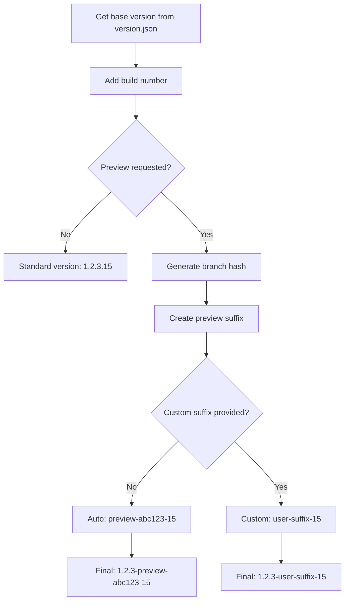

# Feature Branch Build - Developer Guide

## 🏗️ Technical Overview

The `feature-build.yml` workflow is a manually triggered GitHub Actions workflow designed for feature validation and preview release creation. This document covers the technical implementation details for developers maintaining this workflow.

## 📁 File Structure

```
.github/workflows/feature-build.yml    # Main workflow file
.github/scripts/version-management.ps1 # Version handling script
version.json                           # Version configuration
docs/FEATURE-BUILD-USER-GUIDE.md      # User documentation
```

## 🔧 Workflow Architecture

### Trigger Configuration
```yaml
on:
  workflow_dispatch:
    inputs:
      create_preview:
        description: 'Create preview release'
        required: false
        default: false
        type: boolean
      preview_suffix:
        description: 'Custom preview suffix (optional)'
        required: false
        default: ''
        type: string
```

**Design Decision**: Manual trigger only (`workflow_dispatch`) to give developers control over when feature builds run, preventing unnecessary resource usage.

### Environment Variables
```yaml
env:
  DOTNET_VERSION: '8.0.x'
  BUILD_CONFIGURATION: 'Release'
  REGISTRY: ghcr.io
```

**Configuration Notes**:
- `DOTNET_VERSION`: Update when changing .NET target framework
- `BUILD_CONFIGURATION`: Always Release for consistency with deployments
- `REGISTRY`: GitHub Container Registry for preview images

## 🏃‍♂️ Job Flow

### 1. Build and Test Job
**Purpose**: Core validation that always runs
**Dependencies**: None
**Outputs**: Version information for downstream jobs

```yaml
outputs:
  version: ${{ steps.version.outputs.version }}
  full-version: ${{ steps.version.outputs.full-version }}
  preview-version: ${{ steps.preview.outputs.preview-version }}
```

**Key Steps**:
1. **Branch Information Extraction**:
   ```bash
   BRANCH_NAME=${GITHUB_REF#refs/heads/}
   BRANCH_HASH=$(echo $BRANCH_NAME | git hash-object --stdin | cut -c1-8)
   ```
   Creates deterministic 8-character hash from branch name for versioning.

2. **Version Management**:
   ```powershell
   ./.github/scripts/version-management.ps1 -Action get-build -BuildNumber ${{ github.run_number }}
   ```
   Calls PowerShell script to generate version with build number.

3. **Preview Version Creation** (conditional):
   ```powershell
   $previewSuffix = "preview-$branchHash-$('{0:D2}' -f ${{ github.run_number }})"
   ./.github/scripts/version-management.ps1 -Action set-preview -PreviewSuffix $previewSuffix
   ```
   Creates preview version only when `create_preview` is true.

### 2. Docker Build Job
**Purpose**: Container creation for preview releases
**Dependencies**: `build-and-test`
**Condition**: `if: ${{ inputs.create_preview }}`

**Technical Implementation**:
```yaml
- name: Build and push Docker image
  run: |
    dotnet publish src/SimpleWeatherList.Web/SimpleWeatherList.Web.csproj \
      -c ${{ env.BUILD_CONFIGURATION }} \
      -p:PublishProfile=DefaultContainer \
      -p:ContainerRegistry=${{ env.REGISTRY }} \
      -p:ContainerRepository=${{ github.repository_owner }}/simpleweatherlist.web \
      -p:ContainerImageTag=$PREVIEW_VERSION \
      -p:Version=$PREVIEW_VERSION
```

**Design Decisions**:
- Uses .NET 8's built-in container publishing (no Dockerfile needed)
- Dynamic tagging with preview version for uniqueness
- Automatic push to GitHub Container Registry

### 3. Security Scan Job
**Purpose**: Vulnerability assessment for preview releases
**Dependencies**: `build-and-test`
**Condition**: `if: ${{ inputs.create_preview }}`

**Current Implementation**:
```yaml
- name: Run dependency vulnerability check
  run: |
    dotnet list src/SimpleWeatherList.sln package --vulnerable --include-transitive || true
```

**Enhancement Opportunities**:
- Add container scanning with tools like Trivy
- Integrate with GitHub Security Advisories
- Add SAST (Static Application Security Testing)

### 4. Deployment Test Job
**Purpose**: Validate deployment configuration
**Dependencies**: `build-and-test`, `docker-build-and-push`
**Condition**: Preview creation and successful Docker build

**Current State**: Placeholder implementation for future deployment validation

### 5. Summary Job
**Purpose**: Aggregate results and provide unified feedback
**Dependencies**: All previous jobs
**Condition**: `if: always()`

**Key Features**:
- **Result aggregation**: Determines overall success/failure
- **GitHub Step Summary**: Creates markdown summary in Actions UI
- **Conditional logic**: Different success criteria for preview vs. non-preview builds

## 🔍 Technical Deep Dive

### Version Generation Algorithm



### Container Registry Strategy

**Registry URL Format**:
```
ghcr.io/{repository_owner}/simpleweatherlist.web:{preview_version}
```

**Example**:
```
ghcr.io/ormico/simpleweatherlist.web:1.2.3-preview-a1b2c3d4-15
```

**Authentication**: Uses `GITHUB_TOKEN` with automatic permissions for container registry.

### Artifact Management

**Build Artifacts**:
- **Location**: GitHub Actions artifacts
- **Retention**: 30 days
- **Content**: Compiled application binaries
- **Trigger**: Only for preview releases

**Image Manifest**:
- **Purpose**: Metadata tracking for containers
- **Retention**: 90 days
- **Content**: Image URL, version, build info, timestamps

```json
{
  "image": "ghcr.io/ormico/simpleweatherlist.web:1.2.3-preview-abc123-15",
  "version": "1.2.3-preview-abc123-15",
  "branch": "feature/user-authentication",
  "commit": "sha256:abc123...",
  "build_date": "2025-09-03T10:30:00Z",
  "build_number": "15",
  "workflow_run": "12345"
}
```

## 🔧 Maintenance

### Common Modifications

#### 1. Changing .NET Version
```yaml
env:
  DOTNET_VERSION: '9.0.x'  # Update this
```

Also update in:
- `uses: actions/setup-dotnet@v3` version matrix
- Project target framework in `.csproj` files

#### 2. Adding Build Steps
Insert between existing steps in `build-and-test` job:
```yaml
- name: Custom build step
  run: |
    # Your custom logic here
```

#### 3. Enhanced Security Scanning
Replace placeholder security scan:
```yaml
- name: Container security scan
  uses: aquasecurity/trivy-action@master
  with:
    image-ref: '${{ env.REGISTRY }}/${{ github.repository_owner }}/simpleweatherlist.web:${{ needs.build-and-test.outputs.preview-version }}'
    format: 'sarif'
    output: 'trivy-results.sarif'
```

#### 4. Custom Deployment Testing
Replace placeholder deployment test:
```yaml
- name: Deploy to test environment
  run: |
    # Deploy preview to test environment
    kubectl set image deployment/app container=${{ env.REGISTRY }}/${{ github.repository_owner }}/simpleweatherlist.web:${{ needs.build-and-test.outputs.preview-version }}
```

### Performance Considerations

#### Caching Strategy
```yaml
- name: Cache NuGet packages
  uses: actions/cache@v3
  with:
    path: ~/.nuget/packages
    key: ${{ runner.os }}-nuget-${{ hashFiles('**/*.csproj') }}
```

**Optimization**: Cache key includes project file hashes for intelligent invalidation.

#### Parallel Job Execution
Jobs run in parallel where possible:
- `docker-build-and-push` and `security-scan` run simultaneously
- Both depend on `build-and-test` completion
- `deployment-test` waits for Docker build success

### Error Handling

#### Build Failures
```yaml
- name: Publish test results
  uses: dorny/test-reporter@v1
  if: always()  # Ensures test results published even on failure
```

#### Conditional Job Execution
```yaml
if: ${{ inputs.create_preview && always() && needs.docker-build-and-push.result == 'success' }}
```
Complex conditions ensure jobs run only when appropriate.

#### Graceful Degradation
```yaml
dotnet list src/SimpleWeatherList.sln package --vulnerable --include-transitive || true
```
Uses `|| true` to prevent security scan failures from breaking builds.

## 🧪 Testing Workflow Changes

### Local Testing
```bash
# Test version management script
./.github/scripts/version-management.ps1 -Action get-build -BuildNumber 99

# Test preview version creation
./.github/scripts/version-management.ps1 -Action set-preview -PreviewSuffix "test-preview-01" -BuildNumber 99
```

### Workflow Testing
1. **Create test branch**: `test/workflow-changes`
2. **Make workflow modifications**
3. **Push and trigger**: Use workflow_dispatch to test
4. **Verify outputs**: Check all job results and artifacts

### Integration Testing
```bash
# Pull and test generated preview image
docker pull ghcr.io/ormico/simpleweatherlist.web:test-version
docker run -p 8080:80 ghcr.io/ormico/simpleweatherlist.web:test-version
curl http://localhost:8080/health
```

## 📊 Monitoring and Metrics

### Key Metrics to Track
- **Build success rate**: % of successful feature builds
- **Average build time**: Monitor for performance regression
- **Preview release usage**: Track preview creation frequency
- **Security scan results**: Monitor vulnerability trends

### Logging Strategy
```yaml
- name: Debug information
  run: |
    echo "Branch: ${{ github.ref_name }}"
    echo "Preview: ${{ inputs.create_preview }}"
    echo "Version: ${{ steps.version.outputs.version }}"
```

## 🚨 Troubleshooting

### Common Issues

#### 1. Version Script Failures
**Symptom**: PowerShell script errors
**Solution**: Check `version.json` format and script permissions

#### 2. Docker Push Failures  
**Symptom**: Registry authentication errors
**Solution**: Verify `GITHUB_TOKEN` permissions and registry access

#### 3. Missing Artifacts
**Symptom**: Artifacts not available for download
**Solution**: Check artifact upload conditions and paths

#### 4. Security Scan Failures
**Symptom**: Security job fails
**Solution**: Review dependencies for vulnerabilities, update packages

### Debug Mode
Add debug logging:
```yaml
- name: Debug workflow state
  run: |
    echo "GitHub Context:"
    echo "Actor: ${{ github.actor }}"
    echo "Repository: ${{ github.repository }}"
    echo "Run Number: ${{ github.run_number }}"
    echo "Ref: ${{ github.ref }}"
```

## 🔗 Integration Points

### With Other Workflows
- **PR Build**: Shares version management logic
- **Release Create**: Similar Docker build process
- **Cleanup**: Targets preview releases for cleanup

### External Dependencies
- **GitHub Container Registry**: For image storage
- **NuGet packages**: Cached for performance
- **PowerShell scripts**: Shared version management logic

### Future Enhancements
- **Integration with deployment platforms**
- **Advanced security scanning**
- **Performance testing integration**
- **Automated rollback capabilities**

---

**Maintenance Owner**: DevOps Team  
**Last Updated**: September 3, 2025  
**Next Review**: Quarterly
