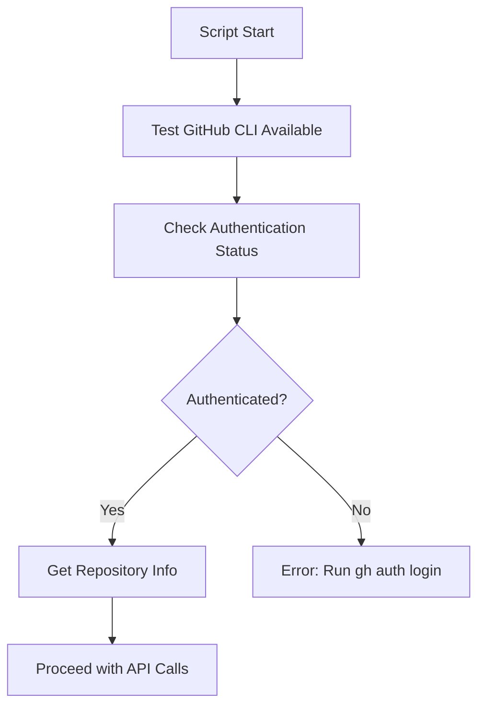
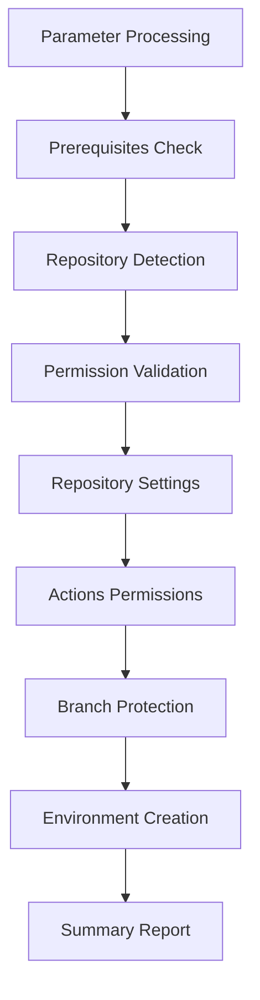

# Repository Setup Script - Developer Guide

## 🏗️ Technical Overview

The `setup-repository.ps1` script is a PowerShell-based automation tool that configures GitHub repository settings via the GitHub CLI and REST API. This document covers the technical implementation for developers maintaining this script.

## 📁 File Location and Structure

### Current Location
```
scripts/setup-repository.ps1
```

### Folder Strategy
```
├── scripts/                    # User-facing scripts (setup, utilities)
│   └── setup-repository.ps1   # Repository configuration script
└── .github/scripts/            # CI/CD workflow scripts
    └── version-management.ps1  # Used by GitHub Actions workflows
```

**Design Decision**: Separate user scripts from workflow scripts for clarity and security.

## 🔧 Architecture

### Dependencies
```powershell
# External Dependencies
- GitHub CLI (gh) - Required for API access
- PowerShell 5.1+ - Core scripting platform
- Git - For repository detection (optional)

# GitHub API Endpoints Used
- /repos/{owner}/{repo} - Repository settings
- /repos/{owner}/{repo}/branches/{branch}/protection - Branch protection
- /repos/{owner}/{repo}/environments/{environment} - Environment creation
- /repos/{owner}/{repo}/actions/permissions - Actions permissions
```

### Authentication Model


### Script Flow


## 🔍 Implementation Details

### 1. Parameter Handling
```powershell
param(
    [Parameter(Mandatory=$false)]
    [string]$RepositoryName = "",
    
    [Parameter(Mandatory=$false)]
    [string]$Owner = "",
    
    [Parameter(Mandatory=$false)]
    [switch]$DryRun = $false
)
```

**Design Decisions**:
- **Optional parameters**: Auto-detection preferred over manual input
- **DryRun switch**: Allows testing without changes
- **No mandatory parameters**: Improves usability

### 2. GitHub CLI Integration
```powershell
function Test-GitHubCLI {
    try {
        $null = gh --version
        Write-Host "✓ GitHub CLI is available"
        return $true
    }
    catch {
        Write-Error "❌ GitHub CLI is not installed or not in PATH"
        return $false
    }
}
```

**Error Handling Strategy**: Graceful degradation with clear error messages and recovery instructions.

### 3. Repository Auto-Detection
```powershell
function Get-RepositoryInfo {
    if (-not $RepositoryName -or -not $Owner) {
        try {
            $repoInfo = gh repo view --json name,owner | ConvertFrom-Json
            $script:RepositoryName = $repoInfo.name
            $script:Owner = $repoInfo.owner.login
        }
        catch {
            Write-Error "❌ Could not detect repository information"
            exit 1
        }
    }
}
```

**Implementation Notes**:
- Uses `gh repo view` for current directory detection
- Falls back to explicit parameters if auto-detection fails
- Updates script-level variables for global access

### 4. Branch Protection Configuration

#### API Payload Structure
```json
{
  "required_status_checks": {
    "strict": true,
    "checks": [
      {"context": "build-and-test"},
      {"context": "security-scan"},
      {"context": "version-check"}
    ]
  },
  "enforce_admins": false,
  "required_pull_request_reviews": {
    "required_approving_review_count": 1,
    "dismiss_stale_reviews": true,
    "require_code_owner_reviews": false
  },
  "restrictions": null,
  "allow_force_pushes": false,
  "allow_deletions": false
}
```

#### Implementation
```powershell
function Set-BranchProtection {
    param([string]$Branch, [array]$RequiredChecks)
    
    # Format checks for GitHub API
    $formattedChecks = @()
    foreach ($check in $RequiredChecks) {
        $formattedChecks += @{ context = $check }
    }
    
    $protection = @{
        required_status_checks = @{
            strict = $true
            checks = $formattedChecks
        }
        # ... (rest of configuration)
    }
    
    # Use temporary file for JSON payload
    $tempFile = [System.IO.Path]::GetTempFileName()
    $protectionJson | Out-File -FilePath $tempFile -Encoding UTF8
    
    $result = gh api repos/$Owner/$RepositoryName/branches/$Branch/protection -X PUT --input $tempFile
}
```

**Key Implementation Decisions**:
- **Temporary file approach**: Avoids PowerShell JSON escaping issues
- **Error handling**: Continues on failure with warnings
- **Status check format**: Uses `checks` array instead of deprecated `contexts`

### 5. Environment Creation

#### Environment Configuration
```powershell
$environment = @{
    wait_timer = $WaitTimer
    reviewers = $Reviewers
    deployment_branch_policy = @{
        protected_branches = $ProtectedBranches
        custom_branch_policies = $false
    }
}
```

#### Environment Mapping
| Environment | Wait Timer | Use Case |
|-------------|------------|----------|
| development | 0 minutes | Immediate deployment for testing |
| testing | 0 minutes | QA validation environment |
| staging | 300 seconds (5 min) | Pre-production validation |
| production | 600 seconds (10 min) | Production deployment with delay |

### 6. Dry Run Implementation

```powershell
if ($DryRun) {
    Write-Host "DRY RUN: Would configure repository settings:"
    Write-Host $settingsJson
} else {
    # Actual API call
    $result = gh api repos/$Owner/$RepositoryName -X PATCH --input $tempFile
}
```

**Benefits**:
- **Safe testing**: Preview changes without applying them
- **Configuration validation**: Verify JSON structure
- **Permission testing**: Test API access without modifications

## 🧪 Testing Strategy

### Unit Testing Approach
```powershell
# Test individual functions
Describe "Set-BranchProtection" {
    It "Should format checks correctly" {
        $checks = @("build-test", "security-scan")
        $result = Format-Checks $checks
        $result.Count | Should -Be 2
        $result[0].context | Should -Be "build-test"
    }
}
```

### Integration Testing
```powershell
# Test against real repository (using test repo)
.\scripts\setup-repository.ps1 -Owner "test-org" -RepositoryName "test-repo" -DryRun
```

### Manual Verification Commands

The following commands were used during development to verify script functionality:

#### 1. Branch Protection Verification
```powershell
# Get branch protection settings
$protection = gh api repos/ormico/github-action-testing/branches/main/protection | ConvertFrom-Json

# Verify required checks
$protection.required_status_checks.checks | ForEach-Object { $_.context }
# Expected: build-and-test, security-scan, version-check

# Verify review requirements  
$protection.required_pull_request_reviews.required_approving_review_count
# Expected: 1
```

#### 2. Environment Verification
```powershell
# List environments
$environments = gh api repos/ormico/github-action-testing/environments | ConvertFrom-Json
$environments.environments | Select-Object name, protection_rules

# Verify specific environment
gh api repos/ormico/github-action-testing/environments/production | ConvertFrom-Json
```

#### 3. Repository Settings Verification
```powershell
# Check merge settings
$repo = gh api repos/ormico/github-action-testing | ConvertFrom-Json
@{
    SquashMerge = $repo.allow_squash_merge
    MergeCommit = $repo.allow_merge_commit
    RebaseMerge = $repo.allow_rebase_merge
    DeleteOnMerge = $repo.delete_branch_on_merge
    AutoMerge = $repo.allow_auto_merge
}
```

### Automated Testing Results

During development testing on `ormico/github-action-testing`:

```
✅ Branch Protection: Successfully applied with all required checks
✅ Environments: All 4 environments created with correct wait timers
✅ Repository Settings: All merge options configured correctly
✅ Actions Permissions: GitHub Actions enabled with write permissions
✅ Error Handling: Graceful failure with manual instructions provided
```

## 🔧 Maintenance

### Common Modifications

#### 1. Adding New Status Checks
```powershell
# In Set-BranchProtection function
$mainBranchChecks = @("build-and-test", "security-scan", "version-check", "new-check")
```

#### 2. Modifying Environment Configuration
```powershell
# Add new environment
New-GitHubEnvironment -EnvironmentName "integration" -WaitTimer 120
```

#### 3. Changing Repository Settings
```powershell
$settings = @{
    allow_squash_merge = $true
    allow_merge_commit = $false
    allow_rebase_merge = $true
    delete_branch_on_merge = $true
    allow_auto_merge = $true
    # Add new settings here
}
```

### Version History

| Version | Date | Changes |
|---------|------|---------|
| 1.0 | Initial | Basic repository setup |
| 2.0 | Sept 2025 | Enhanced error handling, dry run mode, better API integration |

### Performance Considerations

#### API Rate Limiting
```powershell
# GitHub API rate limits (authenticated)
# 5,000 requests per hour per user
# Script makes ~10 API calls total
# Well within limits for normal usage
```

#### Execution Time
- **Typical execution**: 10-30 seconds
- **Dry run**: 5-10 seconds
- **Bottlenecks**: Network latency to GitHub API

## 🚨 Error Handling

### Error Categories

#### 1. Authentication Errors
```powershell
HTTP 401: Bad credentials
Solution: Run 'gh auth login'
```

#### 2. Permission Errors
```powershell
HTTP 403: Forbidden
Solution: Ensure admin access to repository
```

#### 3. API Errors
```powershell
HTTP 422: Validation failed
Solution: Check repository state and branch existence
```

### Debugging Tools

#### Enable Verbose Output
```powershell
$VerbosePreference = "Continue"
.\scripts\setup-repository.ps1 -Verbose
```

#### API Response Debugging
```powershell
# Add to functions for debugging
Write-Debug "API Response: $result"
Write-Debug "Exit Code: $LASTEXITCODE"
```

## 🔐 Security Considerations

### Permissions Required
- **Repository Admin**: Required for branch protection and environments
- **Actions Admin**: Required for workflow permissions
- **Container Registry**: Required for package permissions (future)

### Token Security
```powershell
# Script uses GitHub CLI token
# Token stored securely by GitHub CLI
# No token handling in script code
# Uses --input file to avoid command line exposure
```

### Audit Trail
```powershell
# All changes logged in GitHub audit log
# API calls tracked with user attribution
# Repository settings changes are auditable
```

## 🔗 Integration Points

### With CI/CD Workflows
```yaml
# Workflows expect these status checks
required_status_checks:
  - build-and-test (from pr-build.yml)
  - security-scan (from pr-build.yml)  
  - version-check (from pr-build.yml)
```

### With Deployment Processes
```yaml
# Environments used by deployment workflows
environments:
  - development (immediate)
  - testing (immediate)
  - staging (5 min delay)
  - production (10 min delay + manual approval)
```

## 📋 Future Enhancements

### Planned Improvements
1. **Secret Management**: Automated secret setup
2. **Team Permissions**: Configure team access levels
3. **Webhook Configuration**: Set up deployment webhooks
4. **Monitoring Integration**: Configure monitoring tools

### API Evolution
- **GitHub API v4**: Consider GraphQL migration for complex queries
- **Beta Features**: Integrate new GitHub features as they become available

---

**Maintenance Owner**: DevOps Team  
**Last Updated**: September 3, 2025  
**Next Review**: When GitHub API changes or requirements evolve
